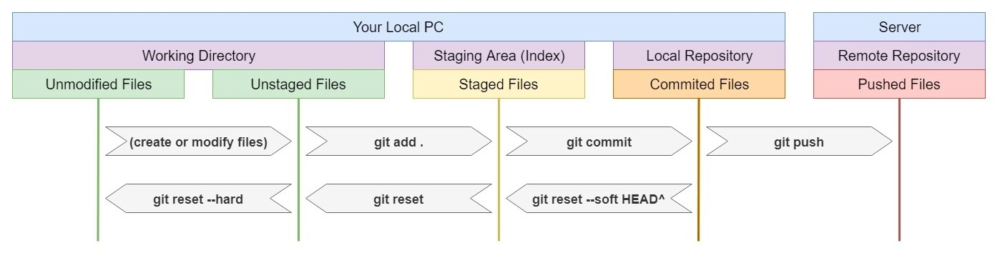

https://www.unix-lab.org/posts/pull-request/

Команды Git.

git init                   // Создать git-репозиторий в текущей папке.
git status                 // Отобразить состояние текущий ветки репозитория в текущей папке.
git pull                   // Копировать все файлы и папки текущей версии текущий ветки
                              с удалённого сервера в текущую папку и попытаться сделать мёрдж этих файлов.
   [АлиасСервера]          // Если задан, позволяет затянуть изменения не с текущего сервера/ветки, а с произвольного.
                              Используется в паре с [АлиасВетки].
   [АлиасВетки]            // Если задан, позволяет затянуть изменения не с текущего сервера/ветки, а с произвольного.
                              Используется в паре с [АлиасСервера].

git checkout               // Переключиться на ветку с именем [ИмяВетки] или на коммит с ID [IDКоммита].
   [ИмяВетки]              // 
   [IDКоммита]
git branch                 // Отобразить или удалить (если задан ключ -d) список веток на удалённом сервере git.
   [ИмяВетки]              // Если задан, создать или удалить (если задан ключ -d) локальную ветку с именем [ИмяВетки].
   -r                      // Отобразить или удалить (если задан ключ -d) список веток на удалённом сервере git.
   -a                      // Отобразить или удалить (если задан ключ -d) список всех веток
                           (локальных и на удалённом сервере git).
   -d                      // Удалить ветку с именем [ИмяВетки].

git add                    // Дабавить файл с именем [ИмяФайла] в индекс локального репозитория (в область stage).
   [ИмяФайла]
   .                       // Добавить все добавленные/изменённые файлы в индекс. Используется вместо [ИмяФайла].
git commit                 // Создать коммит в локальный репозиторий. Все застейдженные файлы будут закомичены.
                              Откроется окно для ввода комментария. После того как файл с комментарием сохранён и закрыт.
                              будет осуществлён коммит.
   -m "[ТекстКомментария]" // Если задан, то позволяет указать комментарий к коммиту прямо в в тексте комманды.
git push                   // Загружает все локальные закоммиченные изменения на сервер.
   [АлиасСервера]          // Если задан, позволяет загрузить изменения не на текущий сервер/ветку, а на произвольный.
                              Используется в паре с [АлиасВетки].
   [АлиасВетки]            // Если задан, позволяет загрузить изменения не на текущий сервер/ветку, а на произвольный.
                              Используется в паре с [АлиасСервера].

git reset --soft HEAD^     // Отменить последний коммит, т.е. перевести файлы из закоммиченных в индекс (в stage).
git reset                  // Отменить stage (обратить git add),
                              т.е. перевести файлы из индекса в список модифицированных файлов.
git reser --hard           // Отменить все изменения, т.е. вернуть файлы к состоянию последнего коммита.

Revert Changes in Git

"Learn Git Branching" is the most visual and interactive way to learn Git on the web; you'll be challenged with exciting levels, given step-by-step demonstrations of powerful features, and maybe even have a bit of fun along the way.
https://learngitbranching.js.org/